# NERC of Different Granularities

Course project for **Formale Semantik** (University of Heidelberg).
We investigate **Named Entity Recognition & Classification (NERC)** under **increasing label granularity** (from coarse-grained up to ultra-fine entity typing).

## Datasets

[OntoNotes: The 90% Solution](https://aclanthology.org/N06-2015/) (Hovy et al., NAACL 2006)

[Fine-grained entity recognition (FIGER)](https://ojs.aaai.org/index.php/AAAI/article/view/8122/7980) (Ling and Weld, AAAI 2012)

[Ultra-Fine Entity Typing](https://www.cs.utexas.edu/~eunsol/html_pages/open_entity.html) (Choi et
al., ACL 2018)

# Dataset Analysis: OntoNotes, FIGER, and Ultra-Fine

## Overview

### Dataset Structure
- [General Analysis](#general-analysis-and-overview)
- [OntoNotes](#ontonotes-the-90-solution-hovy-et-al-naacl-2006)
- [FIGER](#fine-grained-entity-recognition-figer-ling-and-weld-aaai-2012)
- [Ultra-Fine](#ultra-fine-entity-typing-choi-et-al-acl-2018)

### Challenges for T5 and NLI
- [T5](#t5)
- [NLI](#nli)

### Recommended Preprocessing Strategies
- [General Strategies](#general-strategies)
- [Dataset-Specific Strategies](#dataset-specific-strategies)

---

## Dataset Structure

**Note:**  
Since the three datasets differ significantly in structure, we first analyze each dataset individually.

For Ultra-Fine, we split the dataset into:
- **Ultra-Fine Crowdsourced (ds_fine_crowd)**
- **Ultra-Fine Distantly Supervised (ds_fine_ds)**

Due to their substantial differences, we effectively work with **four datasets** in total.

---

## General Analysis and Overview

| Dataset | Task | Granularity | Multi-Label |
|--------|------|------------|------------|
| OntoNotes | Classical NER | Coarse | No |
| FIGER | Fine-Grained Entity Typing | Fine | Yes |
| Ultra-Fine | Ultra-Fine Entity Typing | Very Fine | Yes |

---

### Dataset Size

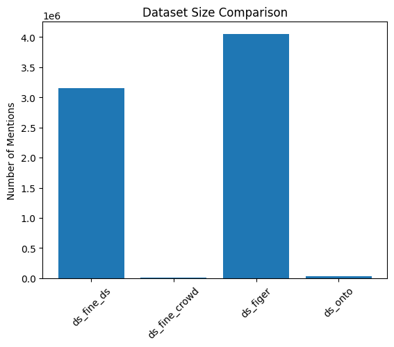

The datasets vary significantly in size.  
**Ultra-Fine** and **FIGER** are substantially larger than **OntoNotes**, while **ds_fine_crowd** is much smaller than **ds_fine_ds**.

---

### Labels

| Dataset | Unique Labels | Multi-Label |
|--------|--------------|------------|
| OntoNotes | 4 | No |
| FIGER | ~100 | Yes |
| Ultra-Fine | 10k+ | Yes |

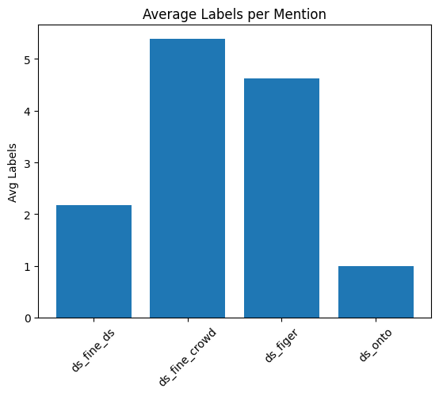

**ds_fine_crowd** has the highest number of labels per mention, closely followed by **FIGER**.  
**OntoNotes** is strictly single-label, while **ds_fine_ds** also has relatively few labels per entity.

---

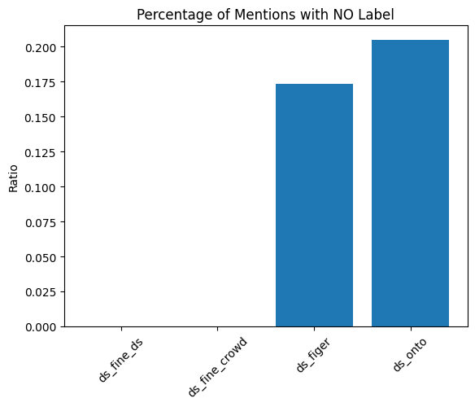

Both **FIGER** and **OntoNotes** contain a portion of mentions without labels.

---

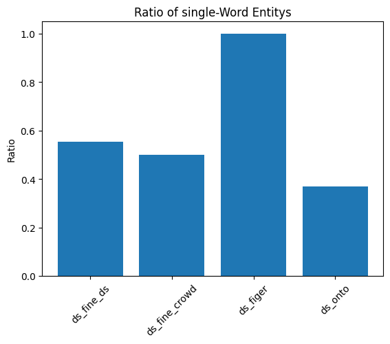

In **FIGER**, all entities are **single tokens**, whereas in the other datasets, a significant portion of entities consists of multiple words.

---

## OntoNotes: The 90% Solution (Hovy et al., NAACL 2006)

OntoNotes is a benchmark dataset for **classical Named Entity Recognition (NER)**.

### ds_onto

| Metric | Value |
|--------|------|
| Entities | 35089 |
| Unique Labels | 4 |
| Multi-word Entities | 12917 (36.81%) |
| Avg Labels/Entity | 1.00 |
| Max Labels/Entity | 1 |

---

### Labels

- PER
- LOC
- ORG
- MISC

OntoNotes contains only four labels and is strictly **single-label**, making it the dataset with the lowest granularity.

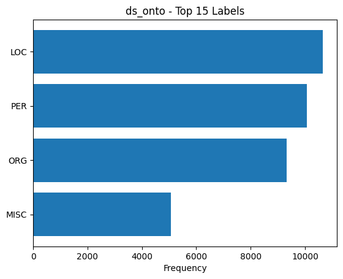

---

## Fine-Grained Entity Recognition (FIGER) (Ling and Weld, AAAI 2012)

FIGER extends classical NER to **fine-grained entity typing**. It is also the **largest dataset** used in this project.

### ds_figer

| Metric | Value |
|--------|------|
| Entities | 4,047,079 |
| Unique Labels | 91 |
| Multi-word Entities | 0 (0.00%) |
| Avg Labels/Entity | 4.62 |
| Max Labels/Entity | 25 |

---

### Labels

Instead of broad categories like *PERSON*, FIGER introduces hierarchical labels such as:

- `/person/actor`
- `/person/politician`
- `/location/city`
- `/organization/company`

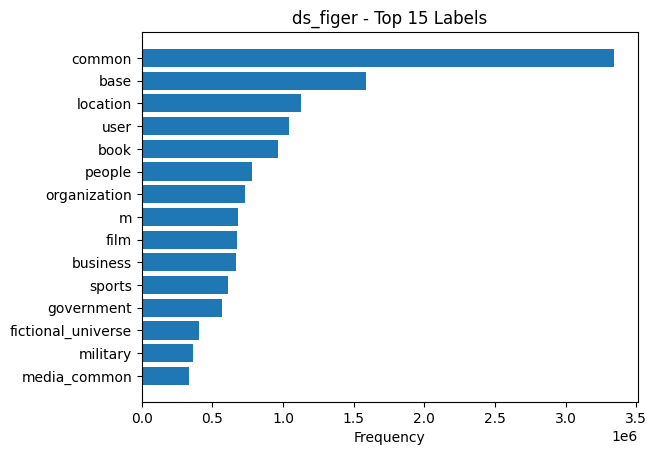

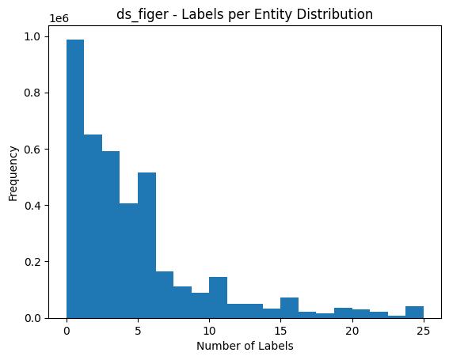

Most entities have between **1 and 5 labels**, although rare cases reach up to **25 labels**.

---

## Ultra-Fine Entity Typing (Choi et al., ACL 2018)

The Ultra-Fine dataset pushes entity typing further by allowing **very specific semantic descriptions**.

---

### Ultra-Fine Distantly Supervised (ds_fine_ds)

| Metric | Value |
|--------|------|
| Entities | 3,152,711 |
| Unique Labels | 4261 |
| Multi-word Entities | 1,749,718 (55.50%) |
| Avg Labels/Entity | 2.18 |
| Max Labels/Entity | 11 |

---

### Ultra-Fine Crowdsourced (ds_fine_crowd)

| Metric | Value |
|--------|------|
| Entities | 5994 |
| Unique Labels | 2519 |
| Multi-word Entities | 3000 (50.05%) |
| Avg Labels/Entity | 5.39 |
| Max Labels/Entity | 19 |

---

### Differences

- **ds_fine_ds** is significantly larger than **ds_fine_crowd**
- **ds_fine_ds** contains more total labels but fewer labels per entity on average

---

### Labels

Labels are often **natural language descriptions** rather than fixed ontology entries.

Examples:

- person
- musician
- politician
- father
- skyscraper

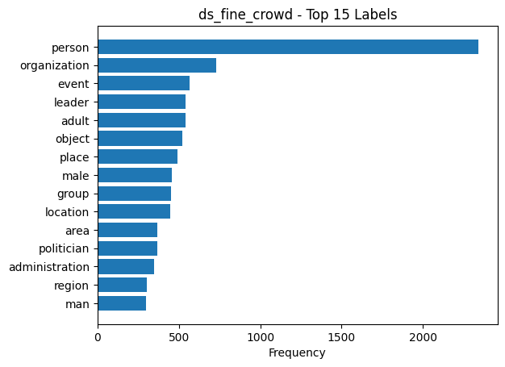

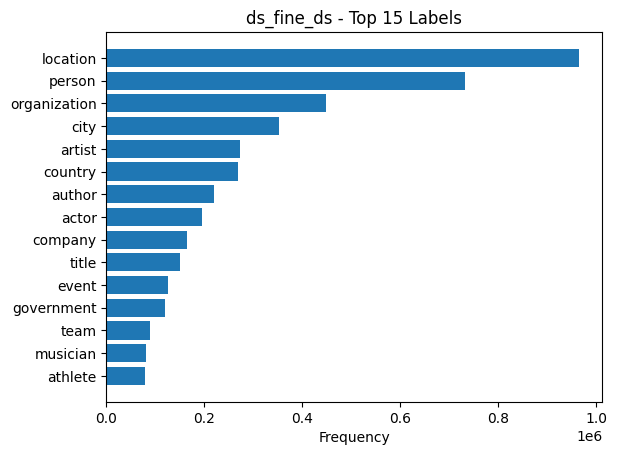

Interresting how **location** in **fine_ds** is the Top Label, but in **fine_crowd** it is way less comon.

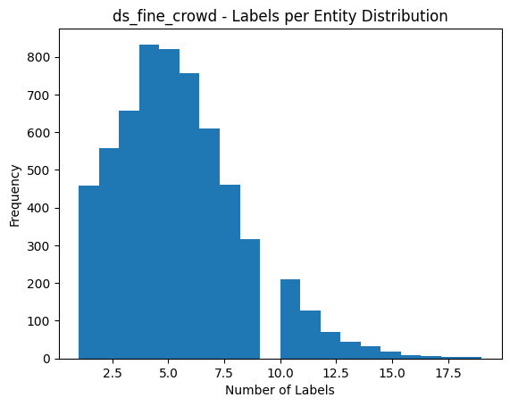

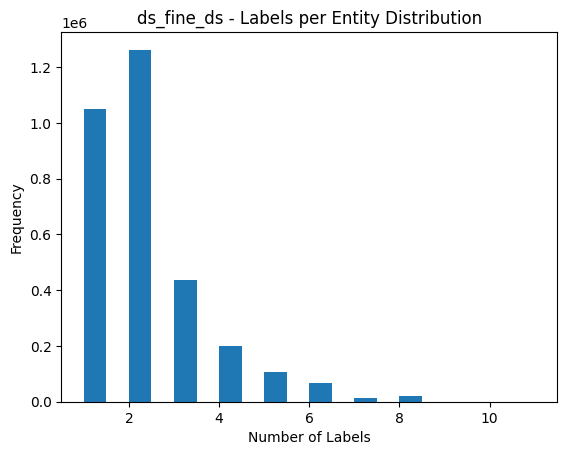

---

# Challenges for T5 and NLI

## T5

### [What is T5? (Wikipedia)](https://en.wikipedia.org/wiki/T5_(language_model)#Applications)

T5 (Text-to-Text Transfer Transformer) is a transformer-based model developed by Google that converts all NLP tasks into a text-to-text format.

---

### OntoNotes

- **Span dependency:**  
The model must correctly identify entity spans before classification.

---

### FIGER

- **Multi-label generation:**  
Entities often have multiple labels → requires generating label sets.

- **Hierarchical labels:**  
Labels require structured understanding.

- **Class imbalance:**  
Frequent labels dominate training.

---

### Ultra-Fine

- **Extremely large label space:**  
Thousands of labels → difficult generalization.

- **Open vocabulary labels:**  
Labels are natural language.

- **Long-tail distribution:**  
Many rare labels.

---

## NLI

### [What is NLI? (Wikipedia)](https://en.wikipedia.org/wiki/Textual_entailment)

---

### OntoNotes

- **Inefficient formulation:**  
Too few labels for NLI to be efficient.

---

### FIGER

- **Ignored label dependencies:**  
Hierarchy is not modeled.

---

### Ultra-Fine

- **Label ambiguity:**  
Semantic overlap between labels.

---

# Recommended Preprocessing Strategies

## General Strategies

### 1. Label Normalization

Convert labels into a consistent format:

- `/person/actor` → actor  
- `film_actor` → actor  

---

### 2. Lowercasing and Cleaning

- Convert to lowercase  
- Remove special characters (`/`, `_`)

---

## Dataset-Specific Strategies

### OntoNotes

- Extract one label per entity span  

**Map labels to natural language:**

- PERSON → person  
- ORG → organization  

---

### FIGER

**Example:**

Muddy Waters → ['/person/musician', '/person/actor', '/person/artist']

- Split hierarchical labels:
  
'/person/actor' → person, actor

- Optionally limit hierarchy depth

---

### Ultra-Fine

**Example:**

They → ['expert', 'scholar', 'scientist', 'person']

- Frequency filtering  
- Remove rare labels (<10 occurrences)

- Top-k selection  
- Keep most relevant labels per mention

---

## Strategies for T5

Format output as:

**entity → label1, label2, label3**

Use:
- sorted labels  
- limit number of generated labels  

---

## Strategies for NLI

### Template standardization

Example:

"The entity is a musician."
---
