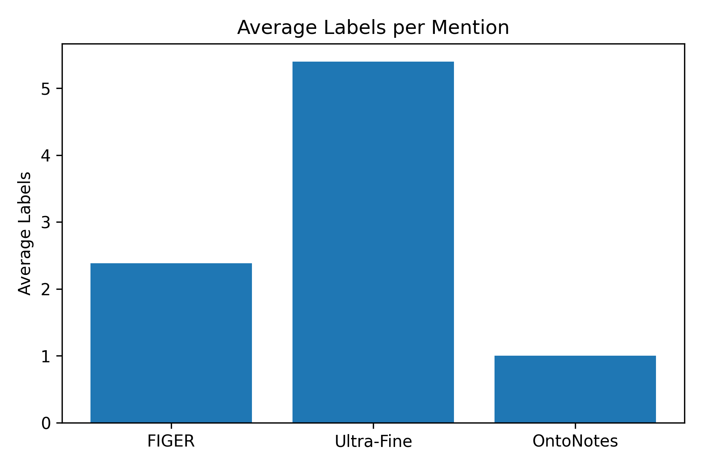
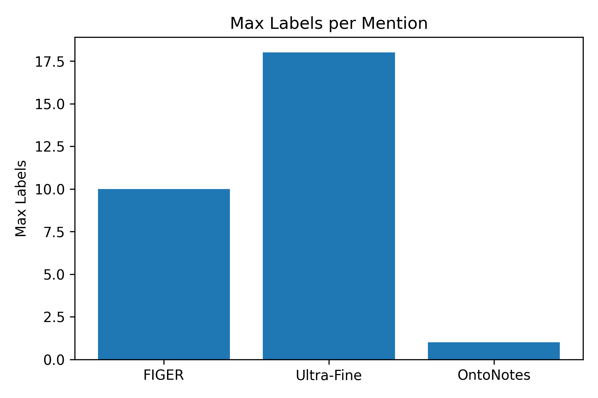
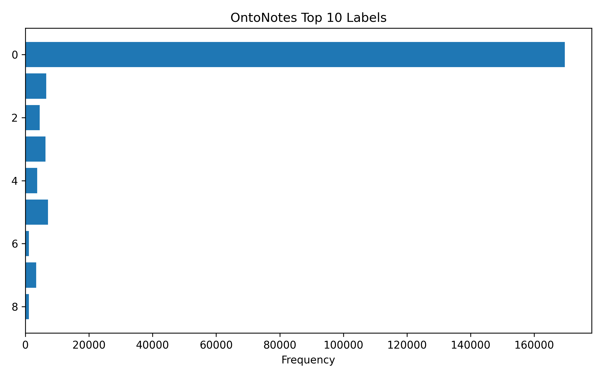
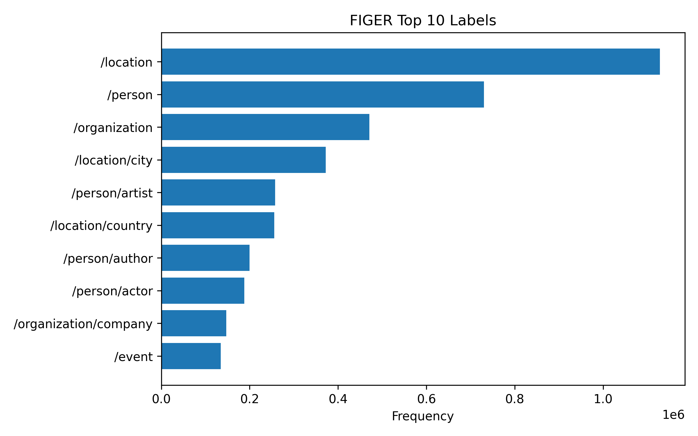
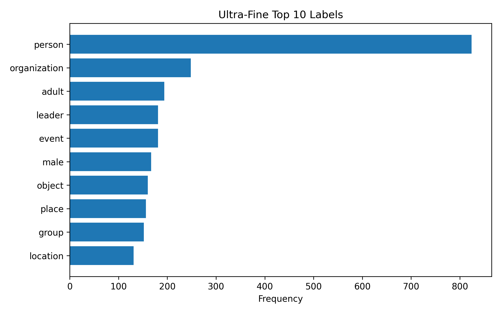

# NERC of Different Granularities

Course project for **Formale Semantik** (University of Heidelberg).
We investigate **Named Entity Recognition & Classification (NERC)** under **increasing label granularity** (from coarse-grained up to ultra-fine entity typing).

## Datasets

[OntoNotes: The 90% Solution](https://aclanthology.org/N06-2015/) (Hovy et al., NAACL 2006)

[Fine-grained entity recognition (FIGER)](https://ojs.aaai.org/index.php/AAAI/article/view/8122/7980) (Ling and Weld, AAAI 2012)

[Ultra-Fine Entity Typing](https://www.cs.utexas.edu/~eunsol/html_pages/open_entity.html) (Choi et
al., ACL 2018)

# NERC Dataset Analysis – OntoNotes, FIGER, and Ultra-Fine

This subproject analyzes three datasets used for **Named Entity Recognition and Classification (NERC)** and **Fine-Grained Entity Typing**.

The goal is to better understand the **structure, complexity, and label distributions** of the datasets before training models such as **T5** or **NLI-based classifiers**.

Datasets analyzed:

- OntoNotes (Hovy et al., NAACL 2006)
- FIGER – Fine-Grained Entity Recognition (Ling & Weld, AAAI 2012)
- Ultra-Fine Entity Typing (Choi et al., ACL 2018)

---

# Dataset Overview

| Dataset | Task | Granularity | Multi-Label |
|-------|------|-------------|-------------|
| OntoNotes | Classical NER | Coarse | No |
| FIGER | Fine-Grained Entity Typing | Fine | Yes |
| Ultra-Fine | Ultra-Fine Entity Typing | Very Fine | Yes |

These datasets represent **three increasing levels of entity typing complexity**.

---

# Dataset Size Comparison

The datasets differ significantly in size.

| Dataset | diffrent Labels | Multi-Label |
|---------|-------------|-------------|
| OntoNotes | 9  | No |
| FIGER | 128  | Yes |
| Ultra-Fine | 1639 | Yes |

FIGER contains the largest number of entity mentions, while OntoNotes is smaller but uses structured NER annotations.

---

# Label Space Comparison

The number of distinct labels varies strongly across datasets.

Observations:

- **OntoNotes** uses a small fixed label set
- **FIGER** expands this to a larger fine-grained taxonomy
- **Ultra-Fine** contains a very large and open-ended label space

This increase in label space complexity significantly affects model difficulty.

---

# Labels per Mention

The number of labels assigned to each entity mention differs across datasets.

## Average Labels per Mention

Observations:

- OntoNotes is **single-label**
- FIGER introduces **multi-label classification**
- Ultra-Fine contains **more descriptive multi-label annotations**

---

## Maximum Labels per Mention

Ultra-Fine occasionally assigns **many labels to a single entity**, reflecting the dataset's goal of capturing rich semantic descriptions.

---

# OntoNotes Dataset

OntoNotes is a benchmark dataset for **classical Named Entity Recognition (NER)**.

### Example Labels

- PERSON
- LOC
- ORG

Example:

| Entity | Label |
|------|------|
| Barack Obama | PERSON |
| Apple | ORG |

These labels are **coarse-grained** and mutually exclusive.

---

## Label Distribution

OntoNotes shows a strong **class imbalance**.

Most frequent classes include:

- PERSON
- ORG
- GPE

Rare classes include:

- CITY
- COUNTRY

This imbalance can affect model performance.

Compared to FIGER and Ultra-Fine, OntoNotes has a **much more compact label distribution**.

---

# FIGER Dataset

FIGER extends classical NER to **fine-grained entity typing**.

Instead of broad categories like *PERSON*, FIGER introduces hierarchical labels such as:

- `/person/actor`
- `/person/politician`
- `/location/city`
- `/organization/company`

## Top Labels in FIGER

The most frequent labels in the dataset are shown below.

Common entity types include:

- person
- organization
- location

The dataset exhibits a **long-tail distribution**, where many labels occur only rarely.

---

# Ultra-Fine Entity Typing Dataset

The Ultra-Fine dataset pushes entity typing further by allowing **very specific semantic descriptions**.

Examples of labels:

- person
- musician
- politician
- father
- skyscraper

Labels are often **natural language descriptions** instead of fixed ontology entries.

---

## Top Labels in Ultra-Fine

The label distribution shows a strong **long-tail behavior**.

Many labels appear only a few times.

---

# Dataset-Specific Challenges for T5 and NLI

# OntoNotes

## Challenges for T5

- **Span dependency:**
The model must correctly identify entity spans before classification.

## Challenges for NLI-based Approaches

- **Inefficient formulation:**
With only 9 labels, NLI formulations (one hypothesis per label) are unnecessarily expensive.

---

# FIGER

## Challenges for T5

- **Multi-label generation:**
Entities often have multiple labels → T5 must generate sets of labels, not single outputs.

- **Hierarchical labels:**
Labels like /person/actor require structured understanding.

- **Class imbalance:**
Frequent labels dominate training → rare labels are harder to generate.

---

## Challenges for NLI-based Approaches

- **Scalability problem:**
128 labels → each entity requires many hypothesis checks.

- **Label dependency ignored:**
NLI treats labels independently, but FIGER labels are hierarchical and correlated.

---

# Ultra-Fine

## Challenges for T5

- **Extremely large label space (~1600+):**
The model must generalize to many rare labels.

- **Open vocabulary labels:**
Labels are often natural language → increases generation difficulty.

- **Long-tail distribution:**
Many labels appear only a few times.

---

## Challenges for NLI-based Approaches

- **Label ambiguity:**
Some labels overlap semantically (e.g., musician, artist).

---

# Recommended Preprocessing Strategies

## General Strategies

1. ### Label Normalization

**Convert labels into a consistent format:**

- /person/actor → actor

- film_actor → actor

**Benefits:**

- Reduces sparsity

- Improves generation consistency

2. ### Lowercasing and Cleaning

- Convert all labels to lowercase

- Remove special characters (/, _)

## Dataset-Specific Strategies

### OntoNotes

- Extract one label per entity span

**Map labels to natural language:**

- PERSON → person

- ORG → organization

### FIGER
- **Example Data:**

Muddy Waters ['/person/musician', '/person/actor', '/person/artist', '/person']

- **Split hierarchical labels:**

/person/actor →

person  
actor

**Limit label depth if needed**

### Ultra-Fine

- **Example Data:**

They ['expert', 'scholar', 'scientist', 'person']

- **Frequency filtering**

Remove labels below a frequency threshold (e.g., <10 occurrences)

- **Top-k label selection**

Keep only the most relevant labels per mention

---

## Strategies for T5

### Format output as:

**entity → label1, label2, label3**

### Use:

- sorted labels

- limit max number of generated labels

---

## Strategies for NLI

### Template standardization:

**Example:**

"The entity is a musician."

---

> Status: Work in progress (this repo will evolve as experiments and structure solidify!).
